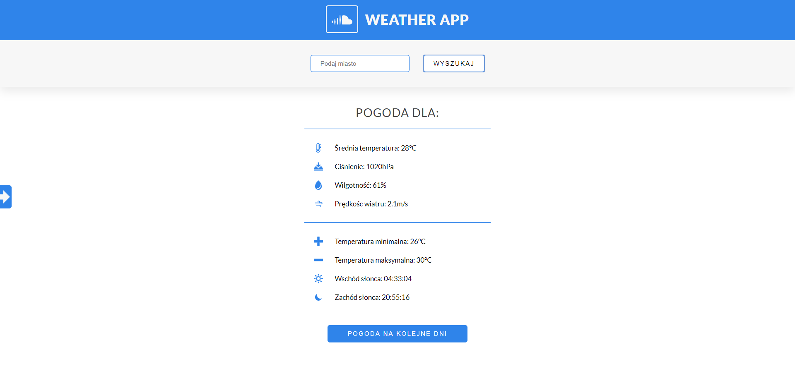

# Weather App

This was my second React aplication ment to get me familiar with working with AJAX/JSON/API using React.
It was made with **mobile first** approach.

In order to see a demo visit [this link](https://tompod92.github.io/Weather-App/)



---

## About the App

It allows the user to check the weather for many different cities.
As a default it show the weather for one day.
By clicking on a arrow button on the left you can see the forecast for next few days

---

## In order to few the source code download/clone this repository

```bash
npm install
npm run start
```
